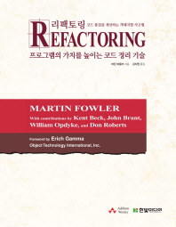

# Hello Refactoring
> '리팩토링 코드 품질을 개선하는 객체지향 사고법' 서적을 학습하고 정리하는 repo

## CONTENTS
- [CHAPTER 01 맛보기 예제](https://github.com/jayden-lee/hello-refactoring/tree/master/src/main/java/ch01)
- CHAPTER 02 리팩토링 개론
- CHAPTER 03 코드의 구린내
- CHAPTER 04 테스트 작성
- CHAPTER 05 리팩토링 기법 카탈로그에 대해
- CHAPTER 06 메서드 정리
- CHAPTER 07 객체 간의 기능 이동
- CHAPTER 08 데이터 체계화
- CHAPTER 09 조건문 간결화
- CHAPTER 10 메서드 호출 단순화
- CHAPTER 11 일반화 처리
- CHAPTER 12 복합 리팩토링
- CHAPTER 13 리팩토링, 재사용, 현실성
- CHAPTER 14 리팩토링 도구
- CHAPTER 15 조각 맞추기
